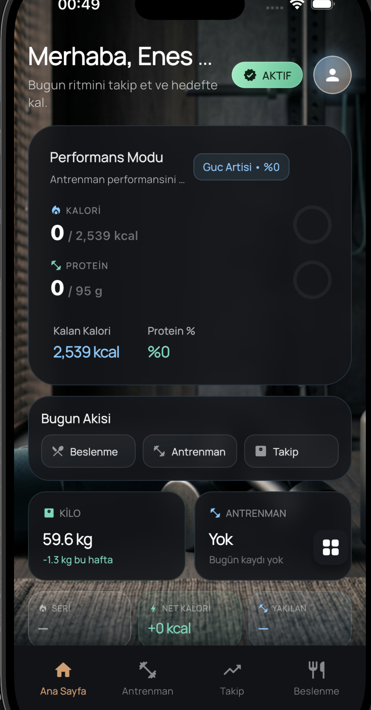
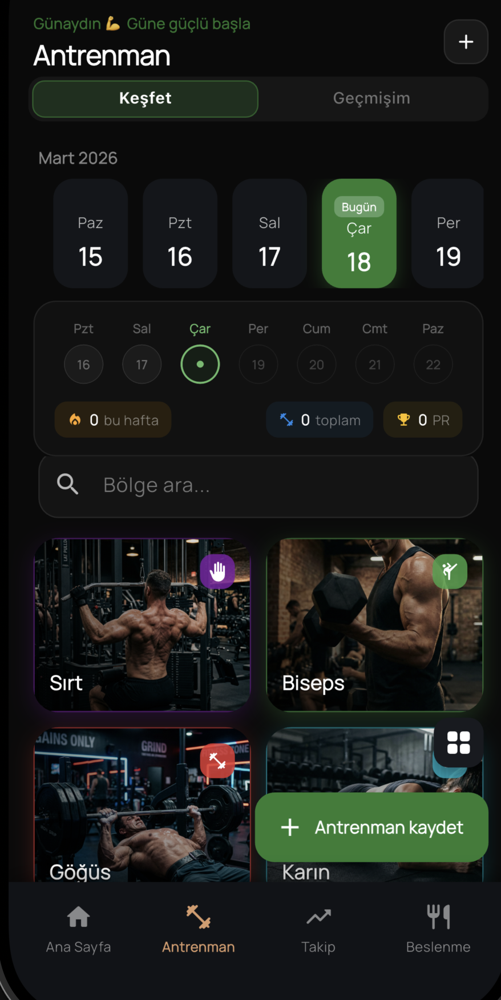
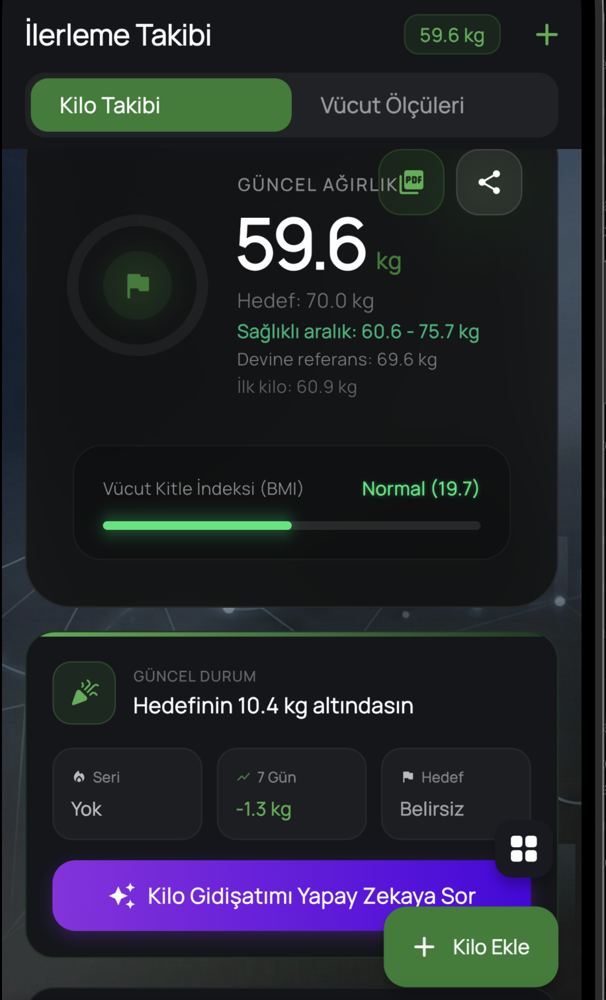
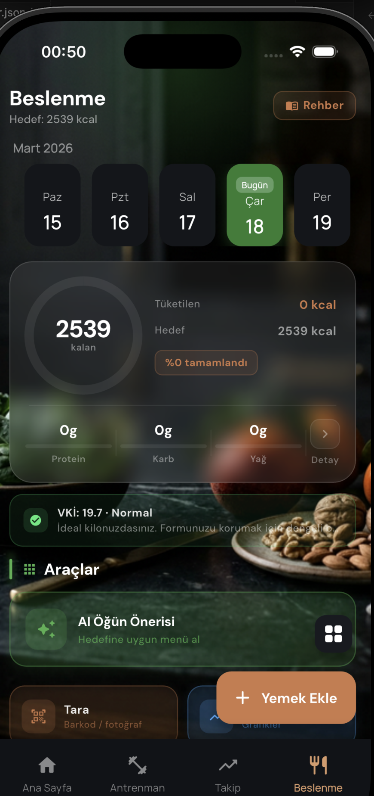

# Fitness App

Kullanicinin antrenmanini, beslenmesini ve fiziksel ilerlemesini tek bir uygulama icinden yonetebilmesi icin gelistirilmis modern bir mobil fitness platformu.

Bu repo iki ana parcadan olusur:

- `frontend/`: Flutter ile gelistirilmis mobil uygulama
- `backend/`: Quarkus tabanli REST API, kimlik dogrulama, AI ve veri yonetimi katmani

## Proje Ozeti

Fitness App; gunluk kalori takibi, makro yonetimi, antrenman planlama, kilo ve vucut olcusu takibi, AI destekli koçluk ve premium deneyim akislarini tek bir urunde birlestirir.

Uygulama, sadece veri kaydi tutan klasik bir fitness takip araci olmak yerine kullaniciyi gun icinde yonlendiren, hedeflerine gore yorum yapan ve sureklilik olusturmaya yardim eden daha butunsel bir deneyim sunmayi hedefler.

## Ekran Goruntuleri

<table>
  <tr>
    <td align="center">
      
      <br />
      <strong>Ana Sayfa</strong>
      <br />
      Gunluk ozet, performans modu ve hizli akis kartlari
    </td>
    <td align="center">
      
      <br />
      <strong>Antrenman</strong>
      <br />
      Bolge bazli kesif, takvim ve hizli antrenman kaydi
    </td>
  </tr>
  <tr>
    <td align="center">
      
      <br />
      <strong>Takip</strong>
      <br />
      Kilo gidisati, BMI, hedef durumu ve ozet kartlari
    </td>
    <td align="center">
      
      <br />
      <strong>Beslenme</strong>
      <br />
      Kalori hedefi, makro dagilimi ve AI destekli ogun araclari
    </td>
  </tr>
</table>

## One Cikan Yetenekler

### Mobil Uygulama

- Gunluk kalori, protein, karbonhidrat ve yag takibi
- Yapay zeka destekli ogun onerileri ve sohbet deneyimi
- Bolge bazli antrenman kesfi ve antrenman kayit akislari
- Kilo takibi ve vucut olcumu girisleri
- Premium ekranlar, bildirim servisleri ve hatirlaticilar
- Offline veri tutma ve senkronizasyon altyapisi

### Backend

- JWT tabanli kimlik dogrulama ve kullanici yonetimi
- Beslenme, takip ve antrenman alanlari icin REST servisleri
- AI coach ve AI nutrition akislari
- Premium ve odeme tarafi icin servis altyapisi
- Flyway migration yapisi ile veritabani evrimi

## Teknoloji Yigini

### Frontend

- Flutter
- Dart
- Mobil odakli UI bilesenleri
- Yerel depolama ve servis katmani

### Backend

- Java
- Quarkus
- PostgreSQL
- Flyway
- JWT

## Klasor Yapisi

```text
.
|-- frontend/
|-- backend/
|-- docs/
|   `-- screenshots/
`-- README.md
```

## Hizli Baslangic

### 1. Frontend kurulumu

```bash
cd frontend
flutter pub get
flutter run
```

AI ozelliklerini aktif etmek istersen `frontend/.env` dosyasi olusturup asagidaki degiskeni ekleyebilirsin:

```env
GEMINI_API_KEY=your_api_key
```

Anahtar tanimli degilse uygulama yine acilir; AI ile ilgili ozellikler devre disi kalir.

### 2. Backend kurulumu

```bash
cd backend
./mvnw quarkus:dev
```

Backend tarafinda gelistirme modunda calismak icin gerekli ortam degiskenleri ve SMTP ayarlari icin [backend/README.md](/Users/eneskotay/Development/Fitness_App-main/backend/README.md) dosyasina bakabilirsin.

## Gelistirme Notlari

- Frontend ve backend ayrik yapida gelisir.
- AI akislarinda gerekli anahtarlar tanimli degilse uygulama temel ozelliklerle calismaya devam edecek sekilde tasarlanmistir.
- Repo icinde ekran goruntuleri `docs/screenshots/` altinda tutulur; GitHub README vitrini buradan beslenir.

## Ek Dokumantasyon

- [frontend/README.md](/Users/eneskotay/Development/Fitness_App-main/frontend/README.md)
- [backend/README.md](/Users/eneskotay/Development/Fitness_App-main/backend/README.md)

